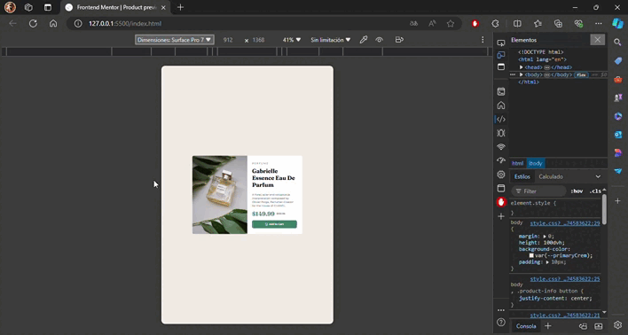

# Frontend Mentor - Product preview card component solution

<div align="left">
  <a href="https://www.linkedin.com/in/danae-lescano-salvatierra" target="_blank">
    
  </a>
  <a href="https://lescano713.github.io/Product-Preview-Card-Component-Main/" target="_blank">
    
  </a>
  <a href="https://www.frontendmentor.io/profile/Lescano713" target="_blank">
    
  </a>
</div>


## Table of contents

- [Overview](#overview)
  - [The challenge](#the-challenge)
  - [Screenshot](#screenshot)
- [My process](#my-process)
  - [Built with](#built-with)
  - [What I learned](#what-i-learned)
  - [Continued development](#continued-development)


## Overview

## The challenge

Your users should be able to:

- View the optimal layout depending on their device's screen size
- See hover and focus states for interactive elements

### Screenshot




## My process

### Built with

- Semantic HTML5 markup
- CSS custom properties
- Flexbox
- Media queries
- Relative Units
- Clamp() Property
- CSS Grid
- desktop-first workflow


### What I learned

<p>In this project, I learned how to effectively use CSS Grid to create a responsive layout without relying on media queries. By applying the grid-template-columns property with repeat(auto-fit, minmax(16rem, 1fr)), I was able to create a grid that adjusts to different screen sizes, ensuring that the content is flexible and adapts to various viewport widths. I also used grid-auto-rows to control the height of the rows, which helped maintain a consistent design while allowing the content to scale appropriately.</p>

```css
.product-container{
    margin: 1em;
    display: grid;
    background-color: var(--neutralWhite);
    grid-template-columns: repeat(auto-fit, minmax(16rem, 1fr));
    width: 585px;
    min-width: 290px;
    grid-auto-rows: minmax(17em, 26rem);
    border-radius: 10px;
}
```


### Continued development

<p>Moving forward, I aim to refine my understanding of CSS Grid by exploring more advanced features such as grid areas and subgrid. Additionally, I plan to experiment with combining CSS Grid with other layout techniques to enhance the responsiveness and flexibility of my designs. Ensuring that the layout adapts seamlessly across a variety of devices and screen sizes remains a key focus, and I will continue to test and iterate to achieve optimal results.</p>


